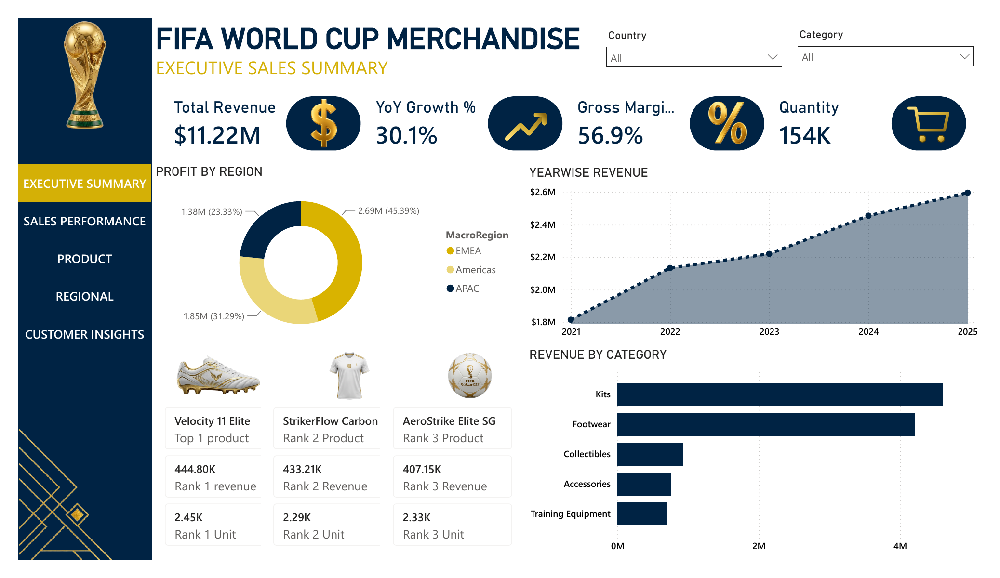

<div align="center">

# 🏆 FIFA World Cup Merchandise — Executive Sales Dashboard

### An end-to-end Power BI Business Intelligence Report | Football-Inspired Design


*A 5-page executive-grade sales report analyzing $11.22M+ in global merchandise revenue across regions, channels, products, and customer segments.*

</div>

---

## 📊 Overview

This project is a **Power BI Football Data Dashboard (FDD)**, built to simulate a global e-commerce reporting suite for **FIFA World Cup Merchandise** sales. It follows a proper **star-schema data model**, uses **custom DAX measures**, and is designed with a clean, premium, football/trophy-inspired visual theme (navy + gold).

The report tells a complete data story — from a high-level executive summary down to granular customer-segment behavior — mirroring how real BI teams structure multi-page enterprise dashboards.

> 💡 Built as part of a Power BI FDD Challenge (Round 1 Entry).

---

## 🗂️ Report Structure

| Page | Focus |
|---|---|
| 🏠 **Executive Summary** | Top-line KPIs, yearwise revenue trend, profit by region, top 3 products |
| 📈 **Sales Performance** | Revenue by quarter/month, session vs revenue trends, conversion rate, YoY growth waterfall |
| 🛍️ **Product** | Revenue vs margin scatter, countrywise revenue, product magic matrix |
| 🌍 **Regional** | Country & channel-wise revenue, sessions vs conversion rate, channel-wise split, Q1–Q4 matrix |
| 👥 **Customer Insights** | Revenue by customer segment, segment × category matrix, AI-generated Smart Narrative |

---

## ✨ Key Highlights

<table>
<tr>
<td width="50%" valign="top">

### 💰 Top-Line KPIs
- **Total Revenue:** `$11.22M`
- **YoY Growth:** `30.1%`
- **Gross Margin:** `56.9%`
- **Units Sold:** `154K`

### 🌍 Profit by Region
- 🥇 EMEA — `45.39%`
- 🥈 Americas — `31.29%`
- 🥉 APAC — `23.33%`

</td>
<td width="50%" valign="top">

### 🥇 Top Performing Products
1. **Velocity 11 Elite** — 444.80K revenue
2. **StrikerFlow Carbon** — 433.21K revenue
3. **AeroStrike Elite SG** — 407.15K revenue

### 🛒 Channel Split
- **Web:** `51.79%` of revenue
- **Mobile App:** `48.21%` of revenue
- 🇬🇧 UK had the highest sessions (1.4M+)
- 🇯🇵 Japan had the highest conversion rate

</td>
</tr>
</table>

---

## 🧠 Smart Narrative Insight

> *"Casual Fans accounted for 55.41% of total revenue (₹62.18L), followed by Hardcore Fans (₹36.84L) and Collectors (₹13.19L). Web outperformed Mobile App by ₹1.32L in Brazil — the largest channel divergence across all countries."*

---

## 🛠️ Tech & Techniques Used

- **Power BI Desktop** — report authoring & visualization
- **Star Schema Data Modeling** — fact/dimension table design for scalable analysis
- **DAX Measures** — YoY Growth %, Gross Margin %, Conversion Rate, Ranked Revenue/Units per product
- **Smart Narrative (Q&A/NLG)** — auto-generated natural language insights
- **Custom Theme** — navy & gold football/trophy-inspired branding
- **Cross-filtering & Drill-through** — interactive Country, Category, and Segment filters

---

## 📁 Repository Contents

```
├── FIFA_WorldCup_Merchandise.pbix     # Main Power BI report file
├── /screenshots                       # Dashboard page exports (PNG/PDF)
└── README.md                          # You're here
```

---

## 🚀 How to Explore

1. Clone this repo:
   ```bash
   git clone https://github.com/<your-username>/<repo-name>.git
   ```
2. Open `FIFA_WorldCup_Merchandise.pbix` in **Power BI Desktop**.
3. Use the left-nav buttons to move across the 5 report pages.
4. Interact with the **Country** and **Category** slicers on the Executive Summary page to filter the entire report.

---

## 👤 Author

**Om**
📍 Pune, India
🎓 Computer Engineering | Data Analytics & BI Enthusiast
🏅 Microsoft Certified: **PL-300 (Power BI Data Analyst)** · **DP-600 (Fabric Analytics Engineer)**

[](#)
[](#)

---

<div align="center">

⭐ *If you found this dashboard insightful, consider giving the repo a star!* ⭐

</div>
